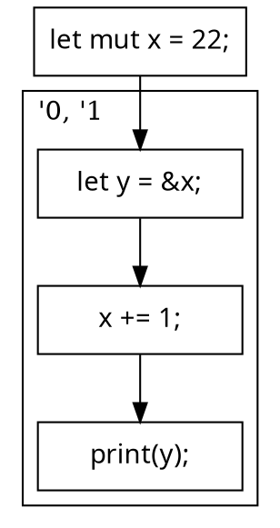

# Polonius

---

"Let's begin with the most important question"

**Where did you get that name?**

---


---

> Neither a borrower nor a lender be;
> For loan oft loses both itself and friend.
> -- Polonius, Hamlet

---

**Little known fact:** Polonius was an experienced C hacker. This made him a bit cautious.

**Good news:** He has since adopted Rust. 

---

> Either a borrower nor a lender be;
> the compiler's got your back.
> -- Polonius, today

---

How Rust borrow checker works today

---

begin with the simplest example

```rust
let mut x: u32 = 22;
let y: &u32 = &x;
x += 1;
print(y);
```

* if you've used rust, you know that the `&x` borrow creates a reference
* as long as this reference is in use, `x` is locked

---

```rust
x += 1;
```

[gives us the error message][TkTTK]

```
error[E0506]: cannot assign to `x` because it is borrowed
 --> src/main.rs:6:5
   |
 5 |     let y: &u32 = &x;
   |                   -- borrow of `x` occurs here
 6 |     x += 1;
   |     ^^^^^^ assignment to borrowed `x` occurs here
 7 |     print(y);
   |           - borrow later used here
```

[TkTTK]: https://play.rust-lang.org/?version=stable&mode=debug&edition=2018&gist=d7c424c90621f7eb5cf39667a4bc4fd4)

I like to think of this as a read-write lock per memory location.  The
shared borrow `&x` acquires a **read lock**. The read lock persists as
long as the resulting reference is in use (or the compiler thinks it
may be).

---

# Let's try to make that more precise

* Error at some program statement N if:
    * N accesses a path P

---

# Definition: Path

A **path** P is an expression that leads to a memory location.

Examples:

* `x` -- a local variable is a memory location on the stack
* `x.f` -- a field of another path is a memory location
* `*x` -- pass through a pointer to some location in the heap
* `x[_]` -- we don't care about indices

---

# Back to our error

* Error at some program statement N if:
    * N accesses a path P
    * P would violate the terms of some loan L

---

# Definition: Loan

A **loan** is a name for a borrow expression like `&x`.

Loans have associated with them:

* a **path** that was borrowed (here, `x`)
* a **mode** with which it was borrowed (either *shared* or *borrowed*)

---

# Violating the "terms" of a loan

For a **shared** loan of some path *P*

* Modifying the path *P* (directly or indirectly)

For a **mutable** loan of some path *P*

* Accessing the path *P* (directly or indirectly)

Directly or indirectly?

```rust
let p = &some_struct;
some_struct.field += 1; // still an error
print(p);
```

---

# Back to our error, again

* Error at some program statement N if:
    * N accesses a path P
    * P would violate the terms of some loan L
    * the loan L is live

---

# Definition: Live Loan

The reference created by the loan -- or some reference derived from it
-- might be used later.

---

# So how do we decide if a loan is **live**?

* How today's borrow checker does it:
    * we compute a **lifetime** for each reference: 
        * that part of the program where the reference may be used.
    * each loan creates a reference
        * the loan is live during the **lifetime of that reference**

---

# So how do we decide if a loan is **live**?

* How Polonius does it:
    * we compute an **origin** for each reference *R*:
        * a set of loans indicating the loans *R* might have come from
    * at any given point in the program, look at the **references** which might be used
        * the union of their origins are the set of live loans

---

```rust
let mut x: u32 = 22;
```

```rust
// the `&x` "acquires" a read lock on `x`
let y: &u32 = &x;
```

```rust
...
print(y);
// "read lock" released after last use of `y`
```

---

let's go a bit deeper

```rust
let mut x: u32 = 22;
let y: &'0 u32 = &'1 x;
x += 1;
print(y);
```

* created lifetime *inference variables* named `'0` and `'1`
* each of these maps to some portion of the program
* so if `y: &'0 u32`, then `'0` represents "those parts of the program where `y` might be used"

---

"those parts of the program?"



---

```rust
/*a*/ let mut x: u32 = 22;
/*b*/ let y: &'{b,c,d} u32 = &'{b,c,d} x;
/*c*/ x += 1;   // Error, but why?
/*d*/ print(y);
```

Idea:
* 
