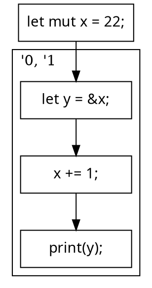

# Polonius

---

"Let's begin with the most important question"

**Where did you get that name?**

---

> Neither a borrower nor a lender be;
> For loan oft loses both itself and friend.
> -- Polonius, Hamlet


---

**Little known fact:** Polonius was an experienced C hacker. This made him a bit cautious.

**Good news:** He has since adopted Rust. 

---

> Either a borrower nor a lender be;
> the compiler's got your back.
> -- Polonius, today

---

How Rust borrow checker works today

---

begin with the simplest example

```rust
let mut x: u32 = 22;
let y: &u32 = &x;
x += 1;
print(y);
```

* if you've used rust, you know that the `&x` borrow creates a reference
* as long as this reference is in use, `x` is locked

---

let's go a bit deeper

```rust
let mut x: u32 = 22;
let y: &'0 u32 = &'1 x;
x += 1;
print(y);
```

* created lifetime *inference variables* named `'0` and `'1`
* each of these maps to some portion of the program
* so if `y: &'0 u32`, then `'0` represents "those parts of the program where `y` might be used"

---

"those parts of the program?"



---

```rust
/*a*/ let mut x: u32 = 22;
/*b*/ let y: &'{b,c,d} u32 = &'{b,c,d} x;
/*c*/ x += 1;   // Error, but why?
/*d*/ print(y);
```

Idea:
* 